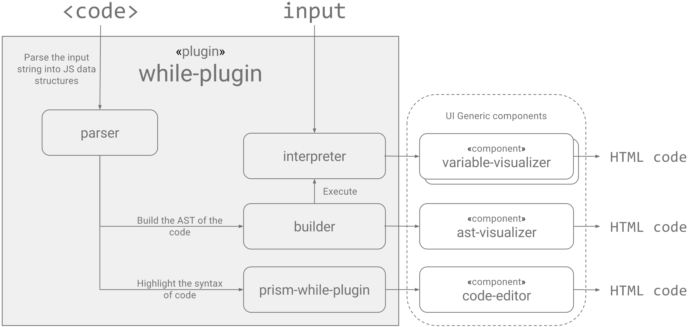

| Title  | While interpreter - Design        |
|--------|-----------------------------------|
| Author | Collaborators                     |
| Status | DRAFT                             |
| Date   | 2017-01-28                        |

## 1. Background
* compwhile support generic system to execute programms.
* A program in language `S` can be executed if it has an implementation of `S-plugin`.

## 2. Components of a language plugin
* **S-Parser**
    * **Goal**: Tokenizing to create JS data structures of the program
      source code.
    * **Input**: String of ASCII symbols (source code of the program).
    * **Output**: Tokens array.
* **S-Builder**
    * **Goal**: Lexical analysis to create an AST for compilation and
      interpretation purposes.
    * **Input**: Tokens array.
    * **Output**: Abstract syntax tree.
* **S-Interpreter**
    * **Goal**: Execute a program `p ∈ S-prog` on value `d ∈ S-data`.
    * **Input**: `p ∈ S-prog` and `d ∈ S-data`.
    * **Output**: The result of executing `p` on input `d`:  `〚p〛d`.
* **Prism-S-Plugin**
    * **Goal**: Create the code data structure that Prism.JS library will be able to
      render.
    * **Input**: Tokens array.
    * **Output**: Prism.JS rules.

## 5. WHILE-plugin
* The WHILE-plugin will be implemented as part of release v0.1.0.
* The plugin contains the following components (implementing the generic
  definitions listed above):
    * while-parser.
    * while-builder.
    * while-interpreter.
    * prism-while-plugin.

